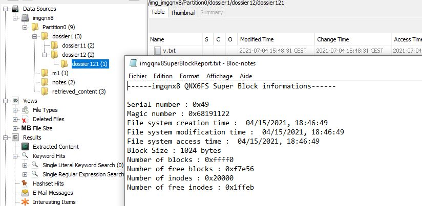
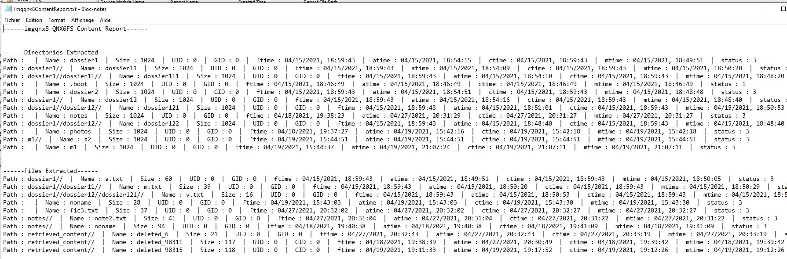
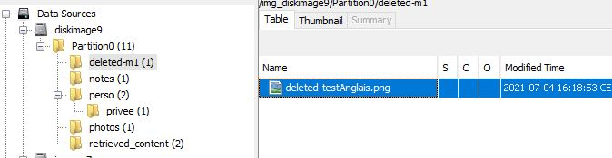
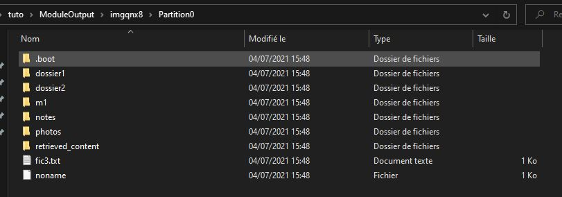

Specifications
======

_Research into the QNX6 file system in order to develop an Autopsy module to recover data (Full report in French ):_  [QNX6_FileSystem_FullReport_FR](https://github.com/jdbonfils/QNX6-Files-System-Reader-Ingest-Module/blob/master/QNX6_FileSystem_FullReport_FR.pdf)

This module has been developped for the forensic software Autopsy. It is able to recover data from a QNX6 device and generate the original file tree. It can also recover some deleted files from devices as well. For the time being, the whole image can not be passed to the module. It is necessary at first to extract the partitions.

**Autopsy is required to run this module :** [[Autopsy | Digital Forensics](https://www.autopsy.com/)]

In Autopsy, **"Unallocated space image file"** must be selected as type of data source in order to run the ingest module properly

Installation
======

Unzip the project archive in \autopsy\python_modules directory. At startup autopsy should detect the ingest module and it should be visible on the user interface as such:

More information to install python ingest modules: [Autopsy User Documentation: Installing 3rd-Party Modules (sleuthkit.org)](http://sleuthkit.org/autopsy/docs/user-docs/4.18.0/module_install_page.html)

Usage
======

### [Ingest module presentation :](http://www.youtube.com/watch?feature=player_embedded&v=H9FppPDLrpY)

### Main features
- **Get file system metadata**

- **Get files and directories metadata**

- **Recover the original file tree**

- **Recover some files that have been deleted from the file system**

- **Files are extracted into : \AutosyCaseName\ModuleOutput\DataSourceName\PartitionX**

- **Other ingest module ca be run on the extracted data**

References
======

Special thanks to these projects that allowed me to develop this ingest module and to understand the QNX6 file system: 

[nop.ninja - Mathew Evans](https://nop.ninja/)

[Snapshot of the QNX6 filesystem - univ-grenoble-alpes ](https://gricad-gitlab.univ-grenoble-alpes.fr/jonglezb/linux-kaunetem/-/tree/505a666ee3fc611518e85df203eb8c707995ceaa/fs/qnx6)
